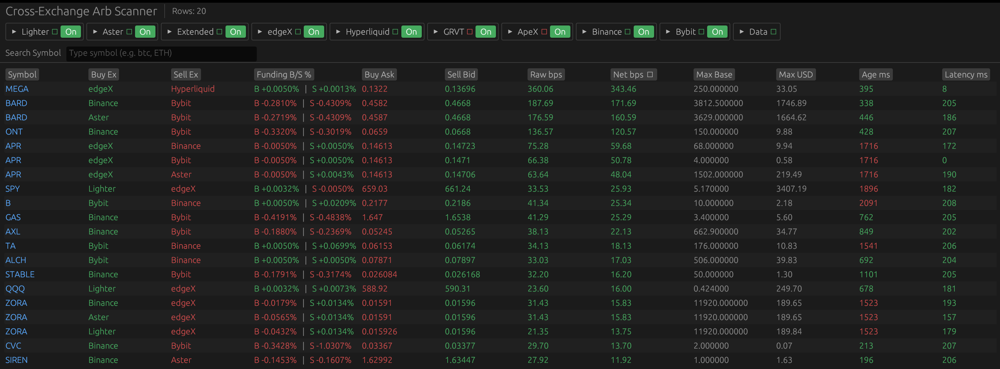
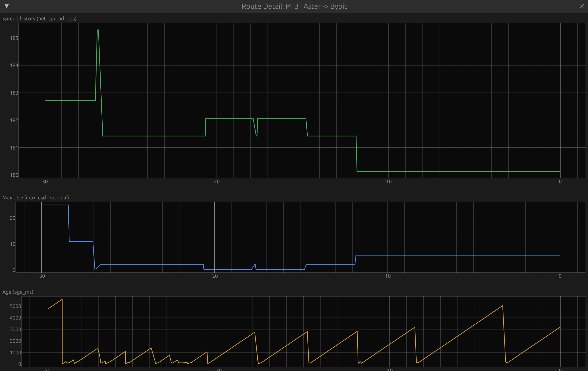

# cross-ex-arb

[](https://github.com/DegenSugarBoo/cross-ex-arb-dashboard/actions/workflows/perf_gates.yml)



`cross-ex-arb` is a Rust desktop scanner and headless market-data collector for cross-exchange perpetual futures.

It discovers common markets across nine venues, normalizes live quote and funding updates, ranks directed buy/sell routes, and can persist the normalized events for replay or research. The project is read-only: it does not place orders, manage positions, or execute trades.

## Features

- Live cross-exchange spread ranking with raw and fee-adjusted basis-point views.
- Per-route size, USD notional, quote age, feed latency, funding, and liveness metrics.
- Searchable/sortable `egui` desktop UI with exchange enable/disable controls.
- Rolling 30-second route history for net spread, available USD, and quote age.
- Headless collector with bootstrap gating, bounded writer/file-descriptor budgets, and `none`, `zstd`, or `lz4hc` output.
- Fast parser/engine benchmarks, websocket transport comparisons, fixtures, and regression gates.



## How it works

1. Fetch active perpetual markets from each configured exchange.
2. Normalize symbols and keep markets available on at least two venues.
3. Stream quotes and funding into a shared event model.
4. Build both directed routes for every exchange pair.
5. Rank routes by `net_bps`; the UI displays the top 20 live rows.
6. Optionally write the raw normalized events to partitioned JSONL files.

## Supported exchanges

| Exchange | Quotes | Funding | Fee used by `net_bps` |
| --- | --- | --- | --- |
| Lighter | WebSocket ticker | REST poller | Per-market discovery fee |
| Aster | WebSocket `bookTicker` | REST `premiumIndex` poller | `0.04%` |
| Binance | WebSocket `bookTicker` | WebSocket `markPrice` | `0.04%` |
| Bybit | WebSocket `tickers` | WebSocket `tickers` | `0.04%` |
| Extended | WebSocket order book | WebSocket funding stream | `0.025%` |
| edgeX | WebSocket depth | WebSocket ticker | Metadata, otherwise `0.038%` |
| Hyperliquid | WebSocket `bbo` | REST `metaAndAssetCtxs` poller | `0.045%` |
| GRVT | WebSocket `v1.ticker.d` | WebSocket `v1.ticker.d` | `0.045%` |
| ApeX | Local snapshot-plus-delta book | WebSocket instrument info | `0.05%` |

Exchange discovery failures are logged and isolated, so an unavailable venue does not prevent the remaining venues from starting. Common-symbol discovery currently excludes `DIA`.

## Requirements and installation

- Rust stable toolchain (`rustup` recommended)
- Network access to the configured exchange REST/WebSocket endpoints
- A desktop environment for scanner mode

```bash
git clone https://github.com/DegenSugarBoo/cross-ex-arb-dashboard.git
cd cross-ex-arb-dashboard
cargo build --release
```

The default public-market-data flows do not require exchange API keys.

## Run

Launch the desktop scanner:

```bash
cargo run --release
```

Run the headless collector:

```bash
cargo run --release -- --collect-mode
```

Useful examples:

```bash
# Write uncompressed files to a temporary directory for a smoke run.
cargo run --release -- \
  --collect-mode \
  --collector-compression none \
  --collector-data-root /tmp/cross-ex-arb-collector-smoke

# Show every available flag and its default.
cargo run -- --help

# Enable structured logs at info level.
RUST_LOG=info cargo run --release
```

Important runtime flags include:

| Flag | Default | Purpose |
| --- | ---: | --- |
| `--stale-ms` | `2500` | Hide routes whose older quote leg exceeds this age. |
| `--funding-poll-secs` | `300` | Baseline interval for REST funding pollers. |
| `--ui-fps` | `60` | Scanner repaint cap. |
| `--http-timeout-secs` | `10` | REST request timeout. |
| `--discovery-refresh-secs` | `600` | Periodic discovery summary interval; `0` disables it. |
| `--collector-data-root` | `data` | Collector output directory. |
| `--collector-compression` | `zstd` | `none`, `zstd`, or `lz4hc`. |
| `--collector-bootstrap-timeout-ms` | `45000` | Maximum collector bootstrap wait. |
| `--collector-bootstrap-buffer-events` | `131072` | Pre-gate event buffer capacity. |
| `--collector-write-buffer` | `16384` | Per-writer buffer size. |
| `--collector-flush-interval-ms` | `1000` | Periodic writer flush interval. |
| `--collector-max-open-files` | `128` | Configured writer-handle budget. |

Every exchange REST, WebSocket, funding, and ApeX depth endpoint can also be overridden from the CLI. Use `cargo run -- --help` for the complete list.

## Spread and fee model

For a directed route that buys at the ask and sells at the bid:

```text
raw_bps = (sell_bid / buy_ask - 1) * 10,000
net_bps = raw_bps - 2 * (buy_fee_pct * 100) - 2 * (sell_fee_pct * 100)
```

The displayed `net_bps` is a conservative screening metric, not executable PnL. It does not include slippage, funding carry, borrow, transfer, withdrawal, VIP-tier, token-discount, or maker/rebate effects. `max_usd_notional` is the smaller displayed top-of-book quantity multiplied by the buy ask.

## Collector output

The default root is `data/`. Files are partitioned as:

```text
data/<SYMBOL>/<exchange>/<record_type>/<YYYY-MM-DD>/<HH>.jsonl[.zst|.lz4]
```

Collector envelopes contain `schema_version`, `record_type`, a monotonic `global_seq`, exchange/symbol metadata, exchange/receive/collection timestamps, and a flattened payload. Collector v1 writes:

- `quote`: bid/ask prices and quantities
- `funding`: rate and next-funding timestamp when available
- `trade_unsupported`: one marker per discovered symbol/exchange tuple; trade streams are not integrated yet

The collector waits until every discovered exchange has produced an event, or until the bootstrap timeout opens the gate, then drains buffered events and begins normal writes. `Ctrl-C` and `SIGTERM` trigger a clean shutdown/flush.

## Development and validation

```bash
cargo fmt --check
cargo test --locked
```

Benchmark and regression helpers:

```bash
cargo run --release --bin perf_profile
cargo run --release --bin collector_codec_bench -- --events 200000 --write-buffer 16384
python3 scripts/collector_codec_bench.py --runs 3
python3 scripts/perf_regression_check.py --baseline benchmarks/perf_after_net_tuning.json --runs 3
python3 scripts/ws_ingest_regression_check.py --baseline benchmarks/ws_ingest_baseline_post_ws_rollout.json --runs 3
```

WebSocket transport/ingest comparison requires the optional feature:

```bash
cargo run --release --bin ws_exchange_ingest_bench --features ws-compare-tungstenite
cargo run --release --bin ws_transport_bench --features ws-compare-tungstenite
```

CI runs the test suite plus the saved engine and WebSocket regression gates on pushes to `main` and pull requests.

## Project layout

- `src/discovery.rs` — market discovery, filtering, symbol normalization, and common-market indexing
- `src/feeds/` — exchange-specific REST/WebSocket adapters and parsers
- `src/engine.rs` — quote/funding state, route construction, spread math, rankings, and 30-second history
- `src/collector.rs` — envelopes, bootstrap gate, partitioning, compression, and writer lifecycle
- `src/ui.rs` — `egui` scanner, exchange controls, table, search, and route-history plots
- `src/config.rs` — CLI flags and defaults
- `src/bin/` — profiling, codec, WebSocket, and Hyperliquid probe binaries
- `tests/` and `fixtures/` — parser, discovery, spread, history, collector, and integration coverage
- `scripts/` — benchmark capture and regression-check helpers

## Caveats

- This is market observation and data collection, not an execution system.
- Venue APIs and fee schedules change; verify endpoints and fee assumptions before relying on the display.
- Collector v1 records quotes and funding only; the explicit unsupported-trade markers prevent that limitation from being mistaken for an empty trade dataset.
